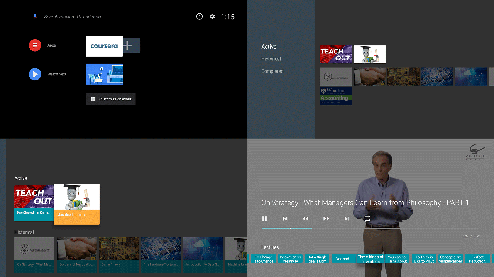

# Coursera TV - Watching your Coursera lectures on Android TV

This is an Android TV app, which is designed for watching your on-going or historical Coursera lecture videos from your Android TV or devices.


## Getting Started

- Clone this repo:

```sh
git clone https://github.com/q1yh/coursera.git
```
- Edit string.xml file in /Res folder for fit your own account.

- Compile and deploy to your Android TV device.


## Screenshots

[](https://github.com/q1yh/coursera-tv/raw/master/screenshot.png)

## License

Licensed under the Apache 2.0 license. See the [LICENSE file][license] for details.

[license]: LICENSE
